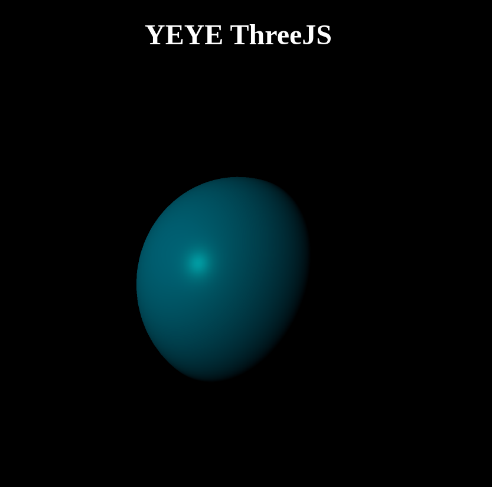

# Proyecto ThreeJS

## Descripción

Este es un proyecto que utiliza ThreeJS para crear gráficos 3D en la web.

## Uso

Para usar este proyecto, sigue estos pasos:

1. Clona el repositorio en tu máquina local.
2. Navega hasta el directorio del proyecto.
3. Ejecuta `npm install` para instalar las dependencias.
4. Ejecuta `npm run dev` para iniciar el servidor de desarrollo.
5. Abre tu navegador y visita `http://localhost:5173`.

## Contribución

Las contribuciones son bienvenidas. Por favor, abre un issue o un pull request para sugerencias de mejora.

[Grabación de pantalla desde 18-04-24 22:44:08.webm](https://github.com/Jerdirlson/ThreeJS/assets/85373298/9454b0e7-0cae-4656-95f1-f420566625eb)
